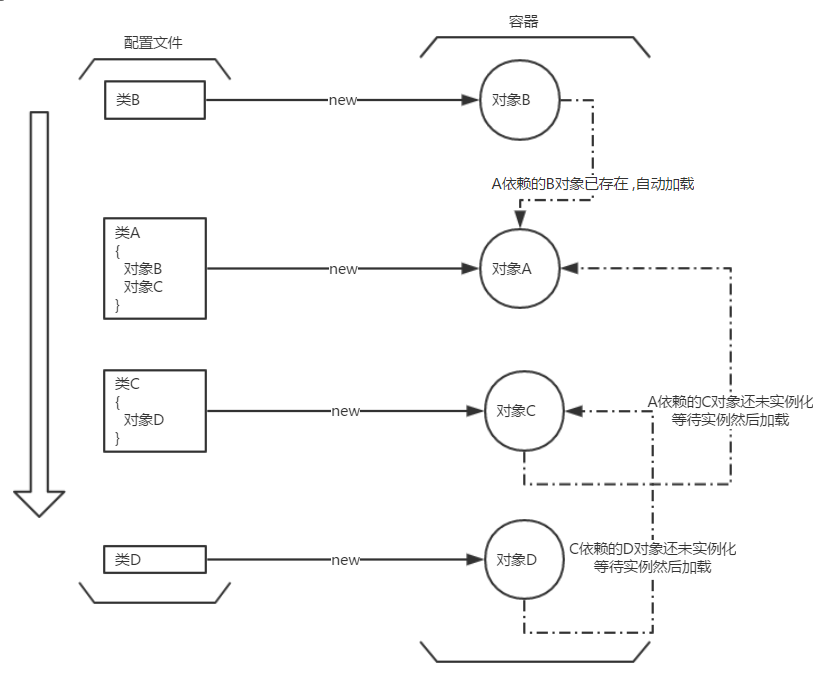

Spring Bean 应该是Spring被使用最多的功能 ,通过注解/xml配置 ,可以简化大量的依赖代码 ,同时也提高了效率 .在试用了Guice和阅读了部分Spring BeanFactory的源码后 ,也了解了一部分依赖注入的原理 ,自己写了一个小框架来印证一下.

## 依赖注入
依赖注入 ,也就是所依赖的对象不由自己处理 ,而是由外部系统去分配 .就像排队取餐时 ,不是每个人自己去盛菜 ,而是告诉服务员自己需要什么 ,由服务员准备好给你 .

这样的好处在于 ,我们不再需要 '盛菜'(new) 这个动作 ,只需要告诉 '服务员'(DI 容器) 我需要 '菜'(依赖的对象) 就可以了 .
对于很多情况下 ,需要的还可能是 '扳手' 这样可复用的工具 ,那么我们就可以避免大量的new动作 ,节省很多对象资源 .

## 如何注入
当我们需要使用某个对象时 ,我们会把它引入到类中 :
```
class A{
	B object;
	void method(){
		object.do();
	}
}
```
直接运行的话 ,object是null ,程序异常 .我们需要在执行method方法前把B的实例(instance)放到object这个位置 .

* constructor - 通过A的构造器传入 - [必须在A初始化前初始化B]
* set - 设置一个set方法 - [需要显式的调用set/使用反射调用set...]
* setField - 反射直接设置属性值

constructor方式需要分析对象依赖的顺序 ,如果有环 ,那么就会死锁 ; set方法和对象的实例化是分离的 ,如果所依赖的对象还没有实例 ,就等待它实例化后再set到需要的类中 ;后两种都是Spring使用过的方法 ,都是使用反射 ;setField不需要生成set方法 ,代码看起来会清洁一点 .


如上图 ,按照配置文件顺序加载 ,如果依赖对象未存在则等待 ,依赖对象实例化后立即回填这个依赖 .

# Cute Koala
首先 ,为这个框架取了一个可爱的名字 Github - [Cute Cute Koala](https://github.com/Anddd7/cute-koala) ,然后按照上图的流程进行设计.


----------


### 配置文件 - 使用注解来标识Bean
使用@Module标识的`UserModule.class`其实就相当于一个配置文件 ,本身没有实际的作用 ,注解看起来更加整洁一些.
```
@Module //标识这是一个模块 ,不同模块的bean互相独立 
public class UserModule {

  @Koala //标识Bean的注解
  HttpService httpService;

  @Koala(UserServiceImpl.class) //如果Bean是一个接口 ,可以指定其实现 ;同一module内不允许设置不同的实现
  UserService userService;

  @Koala(scope = ScopeEnum.NOSCOPE) //Bean是非单例的
  RandomTool randomTool;
}
```

**框架代码:**@Koala注解用来标识Bean的实现(如果声明是Interface) 和 是否单例
```
public @interface Koala {
  Class<?> value() default Koala.class;
  ScopeEnum scope() default ScopeEnum.SINGLETON;
  enum ScopeEnum {
    SINGLETON, NOSCOPE
  }
}
```
通过读取@Module注解的class文件 ,就可以分析出里面所有的Bean

### 衍生问题
* 嵌套依赖
依赖关系一般是多层相互交错的 ,Bean可能依赖另一个Bean ,分析Module Class只是将最表一层的Bean加载到了容器中 ,但他们里面还会有依赖关系的存在 . 如下 ,UserService (实现为UserServiceImpl ) 里面还依赖了其他Bean ,因此我们在扫描Bean的时候需要递归扫描 .
```
public class UserServiceImpl implements UserService {
  @Koala(UserDaoImpl.class)
  UserDao userDao;

  @Koala(scope = ScopeEnum.NOSCOPE)
  RandomTool randomTool;

  public void welcome() {
    System.out.println("Welcome," + userDao.getName());
  }
}
```
**框架代码:** 扫描@Module中的@Koala标记 ,注册到当前@Module的Bean容器中 ;扫描Bean中还有没有@Koala标记 .
```
class ModuleScanner {
  /**
   * 扫描
   */
  private void scanModule(KoalaModule beanModule) {
    log.info("开始扫描模块:{}", beanModule.getModuleName());
    scanClass(beanModule, beanModule.moduleClass);
  }

  /**
   * 扫描类 ,方便树型操作
   */
  private void scanClass(KoalaModule beanModule, Class moduleClass) {
    log.info("开始扫描目标类[{}],路径[{}]", moduleClass.getSimpleName(), moduleClass.getName());
    Arrays.asList(moduleClass.getDeclaredFields())
        .forEach(field -> scanComponent(beanModule, field));
    log.info("扫描类[{}]完毕", moduleClass.getSimpleName());
  }

  /**
   * 扫描需要注入依赖的字段
   */
  private void scanComponent(KoalaModule beanModule, Field field) {
    if (Objects.isNull(field.getAnnotation(Koala.class))) {
      return;
    }

    Class defineType = field.getType();
    Class implementType = field.getAnnotation(Koala.class).value();
    if (implementType.equals(Koala.class)) {
      implementType = defineType;
    }
    Boolean isSingleton = field.getAnnotation(Koala.class).scope().equals(ScopeEnum.SINGLETON);

    log.info("扫描Bean,声明类型[{}] ,实现类型[{}],是否单例[{}]", defineType.getName(), implementType.getName(),
        isSingleton);

    beanModule.createBean(defineType, implementType, isSingleton);

    //递归扫描子模块
    log.info("开始扫描[{}]字段的依赖类[{}]", field.getName(), implementType.getSimpleName());
    scanClass(beanModule, implementType);
  }
}
```

### 创建Module
**框架代码:** 通过@Module进行配置 ,然后交给框架的中心控制器`KoalaFactory`进行扫描 ,就会按照配置生成相应KoalaModule类 ,里面包含Bean容器 ,扫描到的Bean就会进行实例化放入Bean容器 .
```
public class KoalaFactory {

  @Getter
  private List<Class> moduleList;

  private Map<Class, KoalaModule> moduleMap = new HashMap<>();
  private ModuleScanner scanner = new ModuleScanner();

  //可以切换当前module
  private int index;
  private KoalaModule currentModule;

  public static KoalaFactory of(Class... modules) {
    return new KoalaFactory().build(modules);
  }

  /**
   * 构建
   */
  private KoalaFactory build(Class... moduleClasses) {
    moduleList = Arrays.asList(moduleClasses);
    scanAndBuild(moduleClasses);
    first();//设置第一个注册module为当前使用的module
  }

  /**
   * 扫描器扫描并生成 module ,默认设置第一个module为当前的操作module
   */
  private void scanAndBuild(Class... moduleClasses) {
    for (Class moduleClass : moduleClasses) {
      scanner.createModule(moduleClass)//扫描module
          .ifPresent(beanModule -> moduleMap.put(moduleClass, beanModule));
    }
  }
}
```

### 注册实例Bean
**框架代码:** 扫描器在扫描到KoalaModule中符合要求的Bean时 ,就会告知KoalaModule注册这个Bean到容器中.
```
class ModuleScanner {

  /**
   * 创建一个module
   */
  Optional<KoalaModule> createModule(Class moduleClass) {
    if (!isModule(moduleClass)) {
      return Optional.empty();
    }
    KoalaModule newModule = new KoalaModule(moduleClass);
    scanModule(newModule);
    return Optional.of(newModule);
  }

  /**
   * 检查注解标记
   */
  private Boolean isModule(Class moduleClass) {
    return !Objects.isNull(moduleClass.getAnnotationsByType(Module.class));
  }
  //本段代码在前面有
  private void scanComponent(KoalaModule beanModule, Field field) {
    //省略
    log.info("扫描Bean,声明类型[{}] ,实现类型[{}],是否单例[{}]",
        defineType.getName(), implementType.getName(),isSingleton);

    beanModule.createBean(defineType, implementType, isSingleton);
    //省略
  }
}
```
**框架代码:** KoalaModule会创建一个BeanPool ,由这个缓冲池来管理Bean的存取和依赖关系的解决
```
beanPool.addBean(defineType, implementType, isSingleton);
```
**框架代码:** 使用BeanWrapper包装Bean的Class/instance/是否单例等信息 .
```
public class BeanWrapper {
  private Class defineType;//声明类型
  private Class implementType;//实例类型
  private Object instance;//实例对象
  private Boolean singleton;

  public static BeanWrapper of(Class classType, Class implementType, Boolean isSingleton) {
    //new + set
    return beanWrapper;
  }

  /**
   * 根据Bean的条件 创建instance
   * - 单例直接生成对象
   * - 非单例存放class ,在getBean时再实例化
   * - 代理对象(Http RPC ,后续说明)
   */
  void initInstance() {
    try {
      if (!singleton) {
        //非单例 ,object存放实现类型 ,getBean时自动实例化
        instance = implementType;
        return;
      }
      //单例的代理接口 ,生成代理对象
      if (!Objects.isNull(defineType.getAnnotation(HttpKoala.class))) {
        instance = HttpProxyBeanFactory.getProxyInstance(defineType);
        return;
      }
      //单例的Class 或 接口 ,实现类直接实例化
      instance = implementType.newInstance();
    } catch (Exception e) {
      log.error(e.getMessage(), e);
    }
  }
}
```
**框架代码:** 如果不存在Bean ,则注册Bean放入缓冲池 ;然后检查Bean的依赖关系.
```
public void addBean(Class defineType, Class implementType, Boolean isSingleton) {
    BeanWrapper beanWrapper = beanCache.get(defineType);
    if (Objects.isNull(beanWrapper)) {
      //创建新的bean放入cache
      beanWrapper = BeanWrapper.of(defineType, implementType, isSingleton);
      beanCache.put(beanWrapper);
    } else {
      beanWrapper.checkConflict(implementType, isSingleton);
    }

    if (beanWrapper.getSingleton()) {
      //检查自身是否依赖其他bean
      checkRelyFrom(beanWrapper, this::waitOrResolveRely);
    } else {
      log.info("非单例Bean ,获取Bean时再解决依赖");
    }
    //检查自身是否被其他类依赖
    checkRelyTo(beanWrapper);
  }
```

### 衍生问题 
* 依赖解决 ,在BeanPool中设置了2个缓存Map ,一个是放置BeanWrapper的Bean容器 ;一个是依赖关系的管理器 .
```
private final BeanWrapperCache beanCache = new BeanWrapperCache();
//private Map<Class, BeanWrapper> - Class:注册的Bean
private final BeanRelyCache relyCache = new BeanRelyCache();
//private ListMultimap<Class, BeanWrapper> - Class:List<需要Class实例的其他Bean>
```
**框架代码:** 检查是否依赖其他对象 -> 内部有没有@Koala标记的Field ; 处理依赖 (有则set/无则等待)
```java
public class BeanPool {
  private void checkRelyFrom(BeanWrapper beanWrapper,
      BiConsumer<BeanWrapper, Field> biConsumer) {

    log.info("[{}]正在加载 ,检查是否依赖其他对象", beanWrapper.getImplementType().getName());
    //查看其实现类(也就是对应的实例对象)中是否依赖其他Bean
    Arrays.asList(beanWrapper.getImplementType().getDeclaredFields()).forEach(field -> {
      if (!Objects.isNull(field.getAnnotation(Koala.class))) {
        biConsumer.accept(beanWrapper, field);
      }
    });
  }
  
 private void waitOrResolveRely(BeanWrapper beanWrapper, Field field) {
    //获取依赖的Bean的实现类型(对应对象的类型)
    Class implementType = field.getAnnotation(Koala.class).value();
    if (implementType.equals(Koala.class)) {
      implementType = field.getType();
    }

    //查看实例是否已存在
    BeanWrapper oldBeanWrapper = beanCache.get(implementType);
    //检查依赖Bean是否已加载 ,未加载则等待加载
    if (Objects.isNull(oldBeanWrapper)) {
      //放入关系池 等待依赖对象
      relyCache.put(implementType, beanWrapper);
    } else {
      //发现依赖对象set到自身(非单例缓存的是class ,需要在get的时候再set)
      if (beanWrapper.getSingleton()) {
        resolveRely(beanWrapper.getInstance(), field, oldBeanWrapper.getInstance());
      }
    }
  }
 
  private void resolveRely(Object parent, Field field, Object instance) {
    try {
      log.info("!!!\t\t处理依赖:[{}]已加载到[{}]的[{}]字段中.", instance.getClass().getSimpleName(),
          parent.getClass().getName(), field.getName());

      field.setAccessible(true);
      field.set(parent, instance);
    } catch (IllegalAccessException e) {
      log.error(e.getMessage(), e);
    }
  }
}
```
**框架代码:** 检查是否被其他对象依赖 -> 依赖关系中有没有依赖列表
```
/**
   * 获取到 #classType 类型的对象 ,开始检索依赖关系并set到对应位置
   */
  private void checkRelyTo(BeanWrapper beanWrapper) {
    log.info("[{}-{}]正在加载,检查是否被其他对象依赖", beanWrapper.getDefineType(),
        beanWrapper.getImplementType().getName());

    //检查自身的实现类型是否被其他类需要
    relyCache.get(beanWrapper.getImplementType())
        .forEach(parentBeanWrapper -> {
          Object parent = parentBeanWrapper.getInstance();
          //获取parent中属于bean (class一致) 的field ,把bean的instanceset进去
          CollectionTool.dealFirst(//获取列表的第一个符合要求的元素
              parent.getClass().getDeclaredFields(),
              beanWrapper::matchType,//field的类型与bean一致
              t -> resolveRely(parent, t, beanWrapper.getObjectOfInstance())//resolveRely见上一段代码
          );
        });

    relyCache.remove(beanWrapper.getImplementType());
  }
```
**逻辑就和最开始的图上展现的一样 ,有则加载无则等待 ;加载的Bean发现被别人依赖 ,会主动set到需要的地方 .**


### 获取Bean
**框架代码:** 单例的Bean在注册时已经实例化 ,所以直接取instance即可 ;非单例的需要现场newInstance ,如果他依赖了其他单例的Bean ,再现场set一下 ,这样就可以得到符合要求的非单例Bean了 .
```
 public class BeanPool {

  private final BeanWrapperCache beanCache = new BeanWrapperCache();
  private final BeanRelyCache relyCache = new BeanRelyCache();

  /**
   * 获取对应类型的Bean对象
   */
  public <T> T getBean(Class<T> classType) {
    BeanWrapper scope = beanCache.get(classType);
    if (scope.getSingleton()) {
      log.info("当前Bean是单例,直接返回缓冲池中的对象.");
      return (T) scope.getInstance();
    }
    try {
      log.info("当前Bean是非单例的,创建新的对象.");
      //如果是远程代理的Bean ,直接生成远程代理
      if (classType.isInterface() && !Objects.isNull(classType.getAnnotation(HttpKoala.class))) {
        return (T) HttpProxyBeanFactory.getProxyInstance(classType);
      }

      T instance = ((Class<T>) scope.getInstance()).newInstance();
      //创建对象时查看内部是否有依赖关系 ,有则set到instance里
      checkRelyFrom(scope, (beanWrapper, field) ->
          resolveRely(instance, field, getBean(field.getType()))
      );
      return instance;
    } catch (Exception e) {
      log.error(e.getMessage(), e);
    }
    return null;
  }
```

** 一个DI工具就基本成型了 ,测试打印一下 ,嵌套的Bean和容器的快照对比 ,都是正确的 ;单例对象一致 ,非单例为不同对象**
```
    KoalaFactory beanFactory = KoalaFactory.of(UserModule.class);
    HttpService httpService = beanFactory.getBean(HttpService.class);
    UserService userService = beanFactory.getBean(UserService.class);
    RandomTool randomTool = beanFactory.getBean(RandomTool.class);
```
```
通过Factory.getBean
com.koala.services.impl.UserServiceImpl	|	com.koala.services.impl.UserServiceImpl@16267862
com.koala.services.impl.UserServiceImpl	|	com.koala.services.impl.UserServiceImpl@16267862
com.koala.daos.impl.UserDaoImpl	|	com.koala.daos.impl.UserDaoImpl@453da22c
com.koala.daos.impl.UserDaoImpl	|	com.koala.daos.impl.UserDaoImpl@453da22c
com.koala.daos.impl.UserDaoImpl	|	com.koala.daos.impl.UserDaoImpl@453da22c
com.koala.webservice.HttpService$$EnhancerByCGLIB$$9c1900a1	|	github.koala.webservice.resetful.HttpProxyObject@71248c21
com.koala.utils.RandomTool	|	com.koala.utils.RandomTool@442675e1
com.koala.utils.RandomTool	|	com.koala.utils.RandomTool@6166e06f
容器:
com.koala.utils.RandomTool	|	class com.koala.utils.RandomTool
com.koala.services.impl.UserServiceImpl	|	com.koala.services.impl.UserServiceImpl@16267862
com.koala.daos.UserDao	|	com.koala.daos.impl.UserDaoImpl@453da22c
com.koala.services.UserService	|	com.koala.services.impl.UserServiceImpl@16267862
com.koala.webservice.HttpService	|	github.koala.webservice.resetful.HttpProxyObject@71248c21
com.koala.daos.impl.UserDaoImpl	|	com.koala.daos.impl.UserDaoImpl@453da22c
```

----------

## 其他功能

* 模板生成 : 娱乐功能 ,读取yaml配置 生成对应的 Module.java文件

```
modules:
- moduleName: user-http
  packageName: com.koala
  beans:
  - beanName: httpService
    path: com.koala.services.HttpService

  - beanName: userService
    path: com.koala.services.UserService
    implPath: com.koala.services.impl.UserServiceImpl

  - beanName: randomTool
    path: com.koala.utils.RandomTool
    scope: no
```
**To**
```
@github.koala.core.annotation.Module
public class UserHttpModule {

	@github.koala.core.annotation.Koala
  HttpService httpService;

	@github.koala.core.annotation.Koala(value = com.koala.services.impl.UserServiceImpl.class)
	com.koala.services.UserService userService;

	@github.koala.core.annotation.Koala(scope = github.koala.core.annotation.Koala.ScopeEnum.NOSCOPE)
	com.koala.utils.RandomTool randomTool;
}
```

* Http RPC : 对Restful的Http服务做了一个代理
```
@HttpKoala("http://localhost:9999/api")
public interface HttpService {

  @HttpKoalaMethod( "/user")
  User getUser(@HttpKoalaParameter("name") String name);

  @HttpKoalaMethod( "/users")
  User[] getUsers(@HttpKoalaParameter("names") String... names);

  @HttpKoalaMethod(value = "/userList", httpMethod = HttpMethod.POST)
  List<User> getUserList(@HttpKoalaParameter("names") List<String> names);

  @HttpKoalaMethod("/userMap")
  Map<String, User> getUserMap(@HttpKoalaParameter("name") String name);
}
```
**框架代码:** 通过`@HttpKoala/@HttpKoalaMethod/@HttpKoalaParameter`来确定调用的Http URL和方法 ,使用cglib生成了一个代理对象 ,把方法代理成Http调用 .
```
public class HttpProxyObject implements MethodInterceptor {

  /**
   * 代理方法 ,托管给http完成
   *
   * @param o 当前的对象
   * @param method 调用的目标方法
   * @param args 方法参数
   * @param methodProxy cglib派生的子对象
   */
  @Override
  public Object intercept(Object o, Method method, Object[] args, MethodProxy methodProxy)
      throws Throwable {
    Instant start = Instant.now();

    //屏蔽toString ,equals等方法
    Object parentMethodResult = checkProxyMethod(method, args);
    if (parentMethodResult != null) {
      return parentMethodResult;
    }
    log.info("----------------------------------------------");
    log.info("[{}]调用远程方法[{}].", className, method.getName());

    String url = rootUrl + method.getAnnotation(HttpKoalaMethod.class).value();
    HttpMethod httpMethod = method.getAnnotation(HttpKoalaMethod.class).httpMethod();

    //创建请求request
    Request request;
    if (httpMethod.equals(HttpMethod.GET)) {
      request = httpClient.initGet(url + requestParser.formatParameter2Url(method, args));
    } else {
      request = httpClient.initPost(url, requestParser.getMediaType(),
          requestParser.formatParameter2Body(method, args));
    }
    //一个切面 可以检查request
    requestParser.checkRequest(request);

    //执行
    Response response = httpClient.execute(request);

    //解析
    Object result = responseParser.parserResponse(response, method.getReturnType());

    log.info("[{}]远程方法[{}]代理执行时间:[{}]", className, method.getName(),
        Duration.between(start, Instant.now()).toMillis());
    log.info("----------------------------------------------\n");
    return result;
  }
}
```
**框架代码:** Http的请求消息和响应消息都做了一个可替换的parser ,默认是JSON ,只要实现对应的接口 ,在@HttpKoala中设置就可以替换了.
```
public @interface HttpKoala {
  String value();
  Class responseParser() default JsonResponseParser.class;
  Class requestParser() default JsonRequestParser.class;
}
```
**框架代码:** HttpClientPool 是封装的OkHttp ,对外没有依赖 ,比较简洁也很好修改 ; 
```
public class HttpProxyObject implements MethodInterceptor {

  private String className;
  private String rootUrl;

  private AbstractResponseParser responseParser;
  private AbstractRequestParser requestParser;

  private HttpClientPool httpClient = new HttpClientPool();

  /**
   * 创建代理对象 ,添加序列化工具
   */
  HttpProxyObject(Class<?> classType) {
    this.className = classType.getName();
    this.rootUrl = classType.getAnnotation(HttpKoala.class).value();

    //检查解析器
    Class<?> resParserClass = classType.getAnnotation(HttpKoala.class).responseParser();
    Class<?> reqParserClass = classType.getAnnotation(HttpKoala.class).requestParser();
    if (resParserClass.isAssignableFrom(AbstractResponseParser.class) && reqParserClass
        .isAssignableFrom(AbstractRequestParser.class)) {
      log.error("对应的消息解析器必须继承自AbstractResponseParser和AbstractRequestParser.");
      return;
    }

    try {
      responseParser = (AbstractResponseParser) resParserClass.newInstance();
      requestParser = (AbstractRequestParser) reqParserClass.newInstance();
    } catch (Exception e) {
      e.printStackTrace();
    }

    log.info("生成[{}]远程代理Bean,使用[{}]进行结果解析", classType.getName(), resParserClass.getName());
  }
```

### 总结
代码还是要多写才行