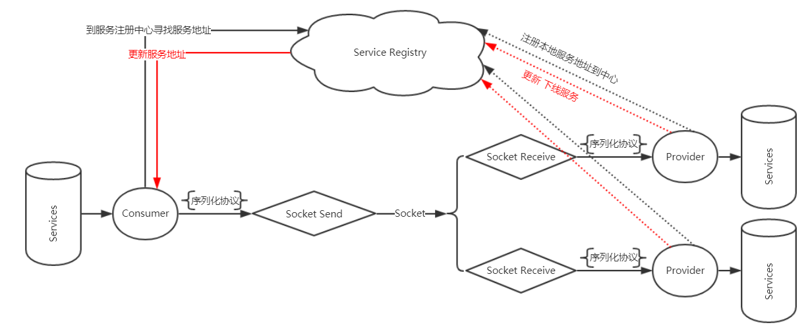

## RPC设计
之前已经做过Restful的远程调用 ,将方法调用整理成http+json ;服务端识别方法 ,使用反射调用具体的服务.

* 对于RPC来说 ,调用双方已经沟通好了方法的调用方式 (通过相同的接口定义) ,http和json都包含了一些冗余信息
* 调用者应该能够探知提供者的可靠性 ,甚至可能有多个提供者
* 调用双方的地址应该是能够动态变更的

## 微服务
通过ZooKeeper管理服务

